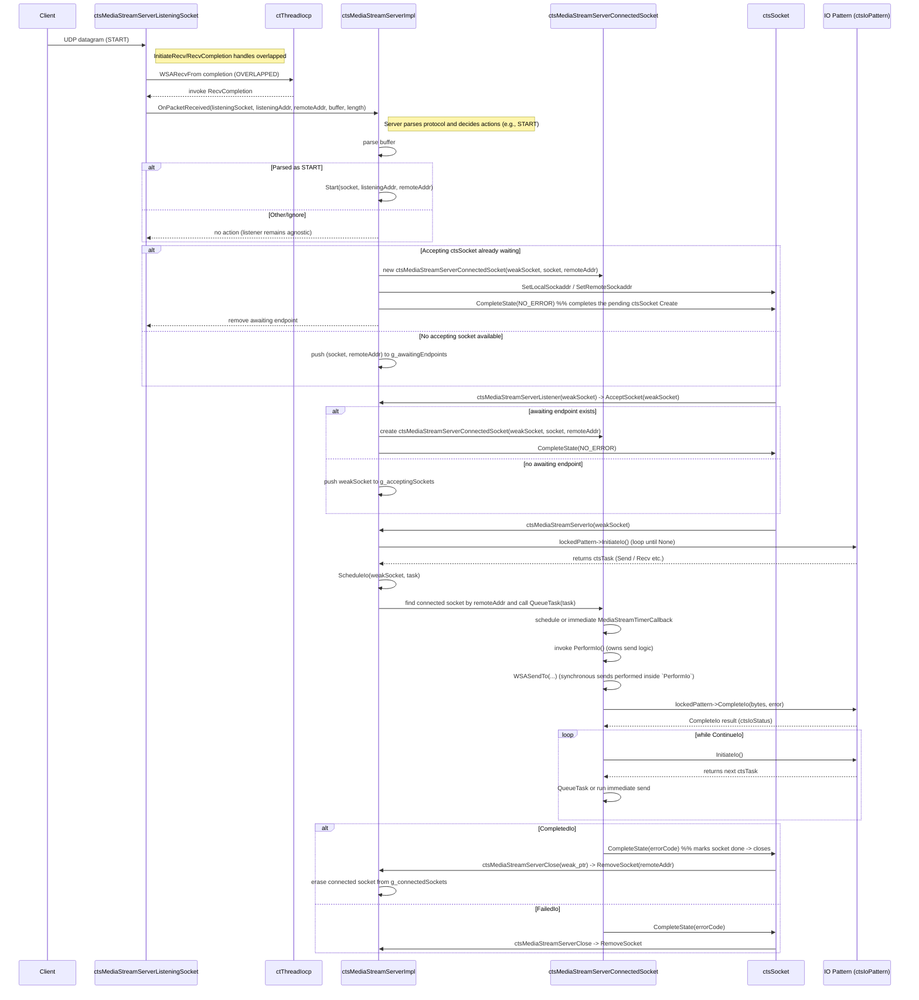

**CTS MediaStream Interactions**

This file shows a sequence diagram (Mermaid) for the interactions between
`ctsMediaStreamServerListeningSocket`, `ctsMediaStreamServerImpl` and
`ctsMediaStreamServerConnectedSocket`. The goal is to understand these
interactions so we can reduce coupling between them.

**Notes / observations**
- **Who owns what:** `ctsMediaStreamServerImpl` manages global vectors:
    - `g_listeningSockets`, `g_connectedSockets`, `g_acceptingSockets`, `g_awaitingEndpoints`.
    - `ctsMediaStreamServerListeningSocket` performs low-level recv and forwards raw packets
      to the server via a callback (`m_packetCallback`). The server implements
      `OnPacketReceived(...)` which parses packets and invokes `Start(...)` for START messages.
    - `g_connectedSockets` is now an `std::unordered_map` keyed by `ctl::ctSockaddr` for O(1)
      lookups instead of a vector scan.
  - `ctsMediaStreamServerConnectedSocket` owns per-connection timers and scheduling.

**Direct coupling points (after refactor / remaining):**
- The listening socket is protocol-agnostic and forwards raw datagrams via an injected
  callback (`m_packetCallback`) — parsing and decision logic now live in `Server::OnPacketReceived`.
- The connected socket no longer depends on a server-supplied `ConnectedSocketIo` functor —
  its send logic is self-contained in `ctsMediaStreamServerConnectedSocket::PerformIo()`.
- `ServerImpl` still holds and mutates the global connection containers (now including an
  unordered_map for `g_connectedSockets`) protected by a single lock, making the server
  the central coordinator and potential contention hotspot.

**Suggestions to reduce coupling**
- Introduce interfaces/events: the current change injects a callback; consider defining a small
  interface (e.g., `IListenerHandler::OnPacketReceived(...)`) if you prefer compile-time
  decoupling over `std::function`.
- Replace global vectors with an injected ConnectionManager (interface) to avoid static globals
  and allow unit-testable, pluggable implementations.
 - Use a factory or builder to create `ConnectedSocket` instances (inject `IConnectedSocketFactory`),
   so `ServerImpl` doesn't `new` the concrete class directly.
 - Limit lock scope and split responsibilities: use per-connection locks or concurrent maps
   for `g_connectedSockets` and `g_awaitingEndpoints` to reduce contention and simplify reasoning.
 - If desired, replace `PerformIo` with an injected `ISender` interface later to allow pluggable
   send strategies; current change keeps the send logic close to the connection to minimize coupling.
- Consider a message-passing queue for START/ACCEPT events between Listener and Server,
  which decouples timing and allows easier sharding/testing.

References: the diagram was produced from reading `ctsMediaStreamServerListeningSocket.cpp`,
`ctsMediaStreamServer.cpp` and `ctsMediaStreamServerConnectedSocket.cpp` in this repository.
