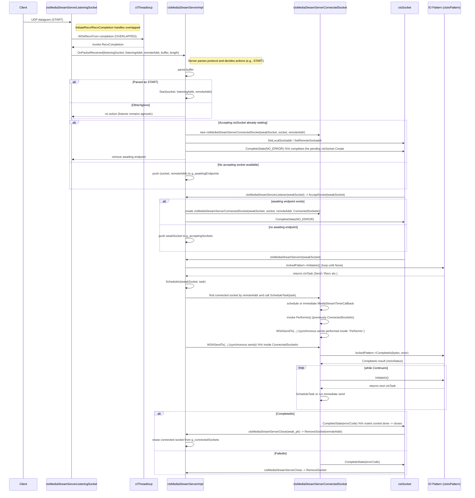

**CTS MediaStream Interactions**

This file shows a sequence diagram (Mermaid) for the interactions between
`ctsMediaStreamServerListeningSocket`, `ctsMediaStreamServerImpl` and
`ctsMediaStreamServerConnectedSocket`. The goal is to understand these
interactions so we can reduce coupling between them.

**Notes / observations**
- **Who owns what:** `ctsMediaStreamServerImpl` manages global vectors:
  - `g_listeningSockets`, `g_connectedSockets`, `g_acceptingSockets`, `g_awaitingEndpoints`.
  - `ctsMediaStreamServerListeningSocket` performs low-level recv and directly calls
    `ctsMediaStreamServerImpl::Start(...)` when it parses a START message.
  - `ctsMediaStreamServerConnectedSocket` owns per-connection timers and scheduling.

 **Direct coupling points (before refactor / remaining):**
 - The listening socket still directly invokes the static `Server::Start(...)` API.
 - The connected socket no longer depends on a server-supplied `ConnectedSocketIo` functor —
   its send logic is self-contained in `ctsMediaStreamServerConnectedSocket::PerformIo()`.
 - ServerImpl still holds and mutates the global connection vectors protected by a single lock,
   making the server the central coordinator and a hotspot for coupling.

**Suggestions to reduce coupling**
- Introduce interfaces/events: make `ListeningSocket` emit a "StartReceived" event (interface)
  instead of calling `Server::Start(...)` directly. Inject a `IStartHandler` into listeners.
- Replace global vectors with an injected ConnectionManager (interface) to avoid static globals
  and allow unit-testable, pluggable implementations.
 - Use a factory or builder to create `ConnectedSocket` instances (inject `IConnectedSocketFactory`),
   so `ServerImpl` doesn't `new` the concrete class directly.
 - Limit lock scope and split responsibilities: use per-connection locks or concurrent maps
   for `g_connectedSockets` and `g_awaitingEndpoints` to reduce contention and simplify reasoning.
 - If desired, replace `PerformIo` with an injected `ISender` interface later to allow pluggable
   send strategies; current change keeps the send logic close to the connection to minimize coupling.
- Consider a message-passing queue for START/ACCEPT events between Listener and Server,
  which decouples timing and allows easier sharding/testing.

References: the diagram was produced from reading `ctsMediaStreamServerListeningSocket.cpp`,
`ctsMediaStreamServer.cpp` and `ctsMediaStreamServerConnectedSocket.cpp` in this repository.
