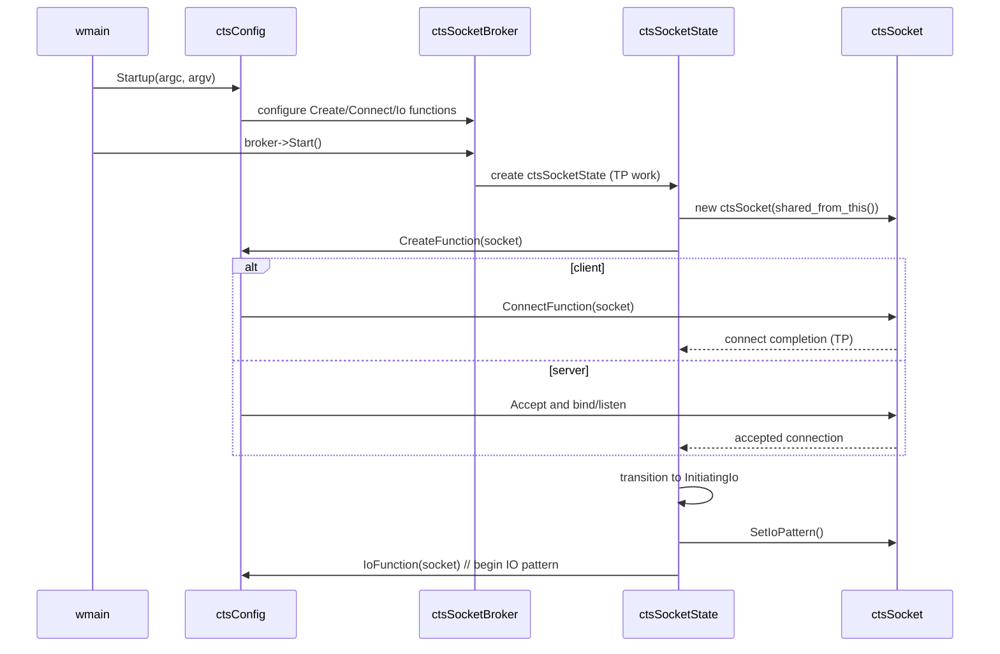
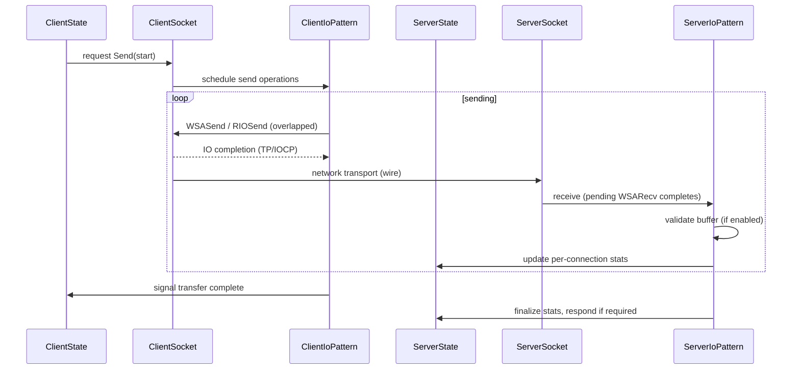
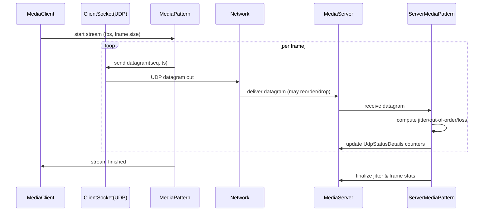

# ctsTraffic Design Specification

This document describes the architecture, components, runtime behavior, configuration and extension points for the ctsTraffic project in this repository. It is intended for maintainers, contributors, and engineers integrating or extending the tool.

## Overview

- Purpose: ctsTraffic is a scalable client/server networking test driver that measures application-level "good-put" and reliability for TCP and UDP across many deployment scenarios.
- Primary language: C++ (Windows-focused).
- Key runtime goals: high scalability (many connections), accurate per-connection statistics, pluggable IO patterns, and deterministic verification of data integrity.

This repo contains a solution with multiple projects but the main executable and runtime are implemented under `ctsTraffic/`.

## High-level architecture

- ctsTraffic.exe (entrypoint)
  - `ctsTraffic.cpp` : program lifecycle, WSAStartup, configuration startup/shutdown, status timer, top-level broker startup and final summary (see [ctsTraffic/ctsTraffic.cpp L46-L180](https://github.com/microsoft/ctsTraffic/blob/7a42478cdb63ef60b182144a564f8465f1d1dc75/ctsTraffic/ctsTraffic.cpp#L46-L180)).
- Configuration and logging
  - `ctsConfig.*` : parses command-line args, stores global `ctsConfig::g_configSettings`, exposes helper functions for printing, options, and socket setup (see [ctsTraffic/ctsConfig.h L432-L444](https://github.com/microsoft/ctsTraffic/blob/7a42478cdb63ef60b182144a564f8465f1d1dc75/ctsTraffic/ctsConfig.h#L432-L444) for the `g_configSettings` declaration, and `-io:rioiocp` handling at [ctsTraffic/ctsConfig.cpp L680-L692](https://github.com/microsoft/ctsTraffic/blob/7a42478cdb63ef60b182144a564f8465f1d1dc75/ctsTraffic/ctsConfig.cpp#L680-L692)).
  - `ctsLogger.*`, `ctsPrintStatus.*` : logging and status output (console and file). See `ctsTraffic/ctsLogger.hpp` and `ctsTraffic/ctsPrintStatus.hpp`.
- Broker (connection lifecycle)
  - `ctsSocketBroker.*` : manages pool of `ctsSocketState` objects, enforces concurrent/pending connection limits, schedules creation of sockets and refreshes pool as connections complete.
- Socket state and socket
  - `ctsSocketState.*` : per-connection state machine that transitions through `Creating` -> `Created` -> (Connecting -> `Connected`) -> `InitiatingIo` -> `InitiatedIo` -> `Closing` -> `Closed`. Uses thread-pool work callbacks to drive state transitions. `ctsSocketState` owns a `TP_WORK` used to run the state-machine callbacks (see enum at [ctsTraffic/ctsSocketState.h L22-L36](https://github.com/microsoft/ctsTraffic/blob/7a42478cdb63ef60b182144a564f8465f1d1dc75/ctsTraffic/ctsSocketState.h#L22-L36) and worker creation in [ctsTraffic/ctsSocketState.cpp L1-L40](https://github.com/microsoft/ctsTraffic/blob/7a42478cdb63ef60b182144a564f8465f1d1dc75/ctsTraffic/ctsSocketState.cpp#L1-L40)).
  - `ctsSocket.*` : core socket wrapper which owns the native `SOCKET`, the I/O pattern object, threadpool helpers (IOCP wrapper, timers), local/remote addresses, and exposes safe locking via `AcquireSocketLock()` (see [ctsTraffic/ctsSocket.h](https://github.com/microsoft/ctsTraffic/blob/7a42478cdb63ef60b182144a564f8465f1d1dc75/ctsTraffic/ctsSocket.h) and [ctsTraffic/ctsSocket.cpp](https://github.com/microsoft/ctsTraffic/blob/7a42478cdb63ef60b182144a564f8465f1d1dc75/ctsTraffic/ctsSocket.cpp)).
- IO patterns
  - `ctsIOPattern.*` : factory and implementations of different IO behaviors (Push, Pull, PushPull, Duplex, MediaStream). Patterns encapsulate per-connection I/O flow, verification, and per-connection statistics.
- Winsock abstraction
  - `ctsWinsockLayer.*` : contains helpers for creating sockets with flags, special socket options, and platform specific behavior (RIO, Registered IO, LSO, ISB notifications, linger-to-reset helpers, etc.).

## Key Components and Responsibilities

- ctsConfig (global configuration)
  - Single global config pointer: `ctsConfig::g_configSettings` (type `ctsConfigSettings`).
  - Command-line parsing, default constants, global stats (connection counts, bytes sent/received), and helpers for setting socket options before/after connect.
  - Provides: connection limits, throttling, protocol selection, IO model selection, buffer sizes, media-stream parameters, and log file names.

- ctsSocketBroker
  - Creates and maintains a pool of `ctsSocketState` objects up to `ConnectionLimit`/`AcceptLimit` and `ConnectionThrottleLimit`.
  - Tracks counts: pending sockets, active sockets, total remaining connection iterations or server-exit limit.
  - Schedules socket creation and removes closed states; exposes `Start()` and `Wait()` for lifecycle.

- ctsSocketState
  - Per-connection lifecycle manager. Owns a `ctsSocket` instance and a threadpool worker object.
  - Drives the state machine using `SubmitThreadpoolWork` callbacks.
  - When entering `InitiatingIo`, notifies broker (`InitiatingIo()`), sets the IO pattern on the socket, and invokes the configured `IoFunction`.
  - On `Closing`, aggregates failure/success metrics and calls `CloseSocket` / `PrintPatternResults` on `ctsSocket`.

- ctsSocket
  - Low-level wrapper around `SOCKET`. Maintains:
    - `m_socket`: the underlying socket handle (wrapped to manage lifetime)
    - `m_pattern`: pointer to `ctsIoPattern` for this connection
    - `m_tpIocp`, `m_tpTimer`: threadpool objects used for IO notifications and timers
    - `m_ioCount`: outstanding IO request counter
  - Provides `SetIoPattern()` which creates and configures the IO pattern object and registers callbacks (implementation at [ctsTraffic/ctsSocket.cpp L176-L194](https://github.com/microsoft/ctsTraffic/blob/7a42478cdb63ef60b182144a564f8465f1d1dc75/ctsTraffic/ctsSocket.cpp#L176-L194)).
  - Note: `SetIoPattern()` calls `ctsIoPattern::MakeIoPattern()` (factory at [ctsTraffic/ctsIOPattern.cpp L96-L112](https://github.com/microsoft/ctsTraffic/blob/7a42478cdb63ef60b182144a564f8465f1d1dc75/ctsTraffic/ctsIOPattern.cpp#L96-L112)); in test scenarios this can return null and `SetIoPattern()` will return early. When `ctsConfig::g_configSettings->PrePostSends` is zero, `SetIoPattern()` will also start the ISB (ideal send backlog) notification sequence via `InitiateIsbNotification()` (see [ctsTraffic/ctsSocket.cpp L200-L280](https://github.com/microsoft/ctsTraffic/blob/7a42478cdb63ef60b182144a564f8465f1d1dc75/ctsTraffic/ctsSocket.cpp#L200-L280)).
    - When an IO pattern completes or an error occurs, `ctsSocket::CompleteState()` will query the pattern for its last error and unregister its callback before notifying the parent `ctsSocketState`.
  - Provides `GetIocpThreadpool()` to lazily create `ctThreadIocp` object when needed. The IOCP wrapper is used to post overlapped IO callbacks.
  - Implements `InitiateIsbNotification()` which uses `idealsendbacklognotify`/`idealsendbacklogquery` to dynamically adjust the ideal send backlog for adaptive send pacing (see [ctsTraffic/ctsSocket.cpp L200-L280](https://github.com/microsoft/ctsTraffic/blob/7a42478cdb63ef60b182144a564f8465f1d1dc75/ctsTraffic/ctsSocket.cpp#L200-L280)).

- ctsIoPattern
  - Factory `MakeIoPattern()` selects concrete IO pattern implementation based on `ctsConfig::g_configSettings->IoPattern` (see [ctsTraffic/ctsIOPattern.cpp L96-L112](https://github.com/microsoft/ctsTraffic/blob/7a42478cdb63ef60b182144a564f8465f1d1dc75/ctsTraffic/ctsIOPattern.cpp#L96-L112)).
  - Pattern responsibilities:
    - Manage per-connection send/recv loop.
    - Pre-post receives/sends based on `PrePostRecvs` / `PrePostSends`.
    - Validate received data patterns (when `ShouldVerifyBuffers` is enabled).
    - Track detailed per-connection statistics for printing and final summary.

### IO Pattern Details (Per-Pattern)

The `ctsIoPattern` subsystem implements several concrete patterns. Each pattern inherits the lifecycle contract expected by `ctsSocket` and must be non-throwing in completion callbacks.

- Push (default client->server send)
  - Behavior: The client continuously sends data until the configured `TransferSize` is reached. The server primarily receives and validates the pattern. After a client finishes sending, it typically waits for a confirmation response from the server.
  - Behavior: The client continuously sends data until the configured `TransferSize` is reached. The server primarily receives and validates the pattern. Some patterns implement a completion/confirmation exchange (for example: send/recv completion messages) depending on the configured protocol/pattern; this behavior is pattern-specific rather than implicit to all Push scenarios.
  - Pre-post behavior: On the receiver, `PrePostRecvs` controls the number of outstanding WSARecv calls. The sender may pre-post sends when using RIO or Registered IO.
  - Verification: Receiver validates each buffer against the configured test pattern when `ShouldVerifyBuffers` is true.
  - Use-cases: Measuring good-put in upload scenarios; simple throughput tests.

- Pull (server->client send)
  - Behavior: Roles inverted from Push — the server sends and the client receives. Useful for download scenarios where the server drives throughput.
  - Timing: The initiator of connection decides which side sends based on `-pattern:pull` flags on both endpoints.

- PushPull (bidirectional burst)
  - Behavior: Both endpoints send and receive in configured bursts. This pattern is useful to exercise bidirectional performance and fairness.
  - Coordination: Each side tracks send and receive quotas and uses the per-quantum rate-limiting policy when configured.

- Duplex (simultaneous full-duplex)
  - Behavior: Both endpoints continuously send and receive data at the same time without explicit burst coordination. This pattern stresses NIC/driver concurrency and stack fairness.
  - Considerations: Requires careful buffer sizing and monitoring to avoid head-of-line blocking.

- MediaStream (UDP framing semantics)
  - Behavior: Implements simulated media streaming semantics (frames, frames-per-second, frame-size).
  - Packetization: Frames are sent as datagrams (UDP) up to `DatagramMaxSize`. Sequence numbers and timestamps are embedded so the receiver can compute jitter, out-of-order, duplicates and loss.
  - Receiver semantics: Tracks per-frame arrival and constructs jitter statistics; updates `UdpStatusDetails` counters for successful/dropped/duplicate/error frames.
  - Use-cases: Real-time media testing, jitter and packet-loss analysis.

Implementation notes common to patterns:

- Rate limiting: Patterns can use `ctsIOPatternRateLimitPolicy` which consults `ctsConfig::GetTcpBytesPerSecond()` and `TcpBytesPerSecondPeriod` to schedule sends in quantums.
  - RIO / Registered IO: When using `WSA_FLAG_REGISTERED_IO` the pattern will use RIO buffers/IDs and adjust behavior to avoid extra buffer copies. See `ctsIOPattern.cpp` for multiple code-paths handling RIO vs overlapped IO (e.g. buffer registration in [ctsTraffic/ctsIOPattern.cpp L120-L220](https://github.com/microsoft/ctsTraffic/blob/7a42478cdb63ef60b182144a564f8465f1d1dc75/ctsTraffic/ctsIOPattern.cpp#L120-L220)). The `-io:rioiocp` argument sets the flag at [ctsTraffic/ctsConfig.cpp L680-L692](https://github.com/microsoft/ctsTraffic/blob/7a42478cdb63ef60b182144a564f8465f1d1dc75/ctsTraffic/ctsConfig.cpp#L680-L692)).
- Shared buffer mode: When `UseSharedBuffer` is enabled in `g_configSettings`, the implementation uses a single reusable buffer for sends/receives (saves memory at the expense of increased coordination).


- ctsWinsockLayer
  - Wraps OS-specific socket creation flags, RIO registration, socket options (SO_REUSE_UNICASTPORT, LSO, RSC), and helper functions used by `ctsSocket` and `ctsConfig`.

## Concurrency and Threading Model

- The program uses the Windows Threadpool (TP) and IO Completion Ports style callbacks implemented via `ctThreadIocp` (a wrapper over IOCP + TP integration).
- Each `ctsSocketState` owns a `TP_WORK` (`m_threadPoolWorker`) to run the state machine on the threadpool.
- The IO pattern uses the IOCP threadpool wrapper for overlapped IO completions. Callbacks from IO operations are executed on threadpool threads and are expected to be fast and non-throwing.
- `ctsSocketBroker` serializes creation/removal of `ctsSocketState` objects with an internal lock; most heavy work occurs in the threadpool callbacks.
- Timers for periodic status updates are implemented with `CreateThreadpoolTimer` in `ctsTraffic.cpp` and per-socket timers using `CreateThreadpoolTimer` stored on the socket.
 - `ctsSocket::CompleteState()` obtains the final pattern error (if any) and unregisters the pattern callback before calling back into the parent `ctsSocketState`.

## Socket Lifecycle Sequence (Client example)

1. `ctsSocketBroker::Start()` creates up to `ConnectionLimit` `ctsSocketState` objects and calls `Start()` on them.
2. `ctsSocketState::ThreadPoolWorker` runs in `Creating` state and constructs a `ctsSocket` and invokes `ctsConfig::CreateFunction`.
3. `ctsConfig::ConnectFunction` (when configured) initiates a connect. On success, `ctsSocketState` transitions to `InitiatingIo` or `Connected`.
4. In `InitiatingIo`, broker is notified via `InitiatingIo()`, the state installs an IO pattern via `ctsSocket::SetIoPattern()` (which can start ISB notifications when appropriate), the state transitions to `InitiatedIo`, and the configured `IoFunction` is invoked to begin send/receive loops.
 - Note: `ctsSocketBroker::Wait()` will also return when `ctsConfig::g_configSettings->CtrlCHandle` is signaled (the code installs a console ctrl handler in `wmain`), so a Ctrl-C will cause the broker to stop earlier than natural completion.
5. IO completions are handled by the IO pattern, which updates per-connection stats and the global stats via `ctsConfig::g_configSettings` counters.
6. On completion or error, the state transitions to `Closing`, the socket is closed, results printed, and the `ctsSocketState` moves to `Closed` and is removed from the broker pool.

## Configuration and Command Line

- `ctsConfig::Startup(argc, argv)` parses a comprehensive set of parameters. Important settings include:
  - `-protocol:` choose TCP or UDP
  - `-listen:` run as server and specify bind addresses
  - `-target:` specify remote server addresses
  - `-connections`, `-iterations`, `-serverExitLimit` control number and lifetime of connections
  - `-transfer` and `-buffer` to adjust per-IO buffer sizes and per-connection transfer sizes
  - `-Io` to select IO model and `-pattern` to select IO pattern
  - `-PrePostRecvs`/`-PrePostSends` to control initial outstanding I/O
  - `-StatusUpdate` frequency and `-consoleverbosity` for logging granularity

The authoritative parsing and defaults are in `ctsConfig.cpp` and the settings structure is `ctsConfig::ctsConfigSettings` defined in `ctsConfig.h`.

## Logging and Status

- Console: configured verbosity levels (0..6) control what is printed. `ctsConfig::PrintStatusUpdate()` publishes periodic aggregated stats.
- Files: `ctsLogger` supports writing status and connection CSV logs when filenames are supplied.
- Connection logs include a GUID `ConnectionId` shared between client and server for cross-correlation.

## Metrics and Statistics

- Global counters in `g_configSettings` include:
  - `ConnectionStatusDetails` (active, successful, network errors, protocol errors)
  - `TcpStatusDetails` and `UdpStatusDetails` track bytes sent/received and frames
- Per-connection stats are kept inside the IO pattern and printed on connection close.

## Extensibility Points

- IO Patterns: add a new pattern implementation under `ctsIOPattern.*` and extend `MakeIoPattern()` to return it.
- Socket options & Winsock features: extend `ctsWinsockLayer.*` to add new socket options or offloads and use them in `ctsConfig::SetPreBindOptions` / `SetPostConnectOptions`.
- Custom logging: implement more `ctsLogger` sinks or change CSV formatting in `ctsPrintStatus`.

## Testing and Unit Tests

- The `documents` and `MSTest/` folders contain unit test projects targeting various components. Several unit tests exist under `MSTest/ctsSocket*` and `ctsIOPattern*` to validate behaviour.

## Build and Run (developer notes)

- This project targets Windows and uses MSVC and a Visual Studio solution `ctsTraffic.sln` located at the repo root.
- Build using the appropriate Visual Studio tooling or `msbuild` on the solution. Ensure the Windows SDK and developer headers are installed.

Example (PowerShell) build command:

```powershell
# from repository root
msbuild .\ctsTraffic.sln /t:Build /p:Configuration=Release
```

Example run (basic client):

```powershell
.\Release\ctsTraffic.exe -target:localhost -connections:8 -transfer:1073741824 -buffer:65536 -consoleverbosity:1
```

Example run (server):

```powershell
.\Release\ctsTraffic.exe -listen:* -consoleverbosity:1
```

## Important Implementation Notes

- Thread-safety is enforced via small critical sections and lock guards. `AcquireSocketLock()` returns a lock plus the socket handle plus the pattern pointer so callbacks can operate safely.
- The design carefully uses threadpool work items and timers to avoid deadlocks when shutting down. `ctsSocketState` performs closing work on the TP thread to avoid holding locks that other callbacks might need.
- ISB (ideal send backlog) notifications are used to dynamically adapt pacing. This feature uses `idealsendbacklognotify`/`idealsendbacklogquery` when available.

## Files of Interest (quick cross-reference)

- `ctsTraffic/ctsTraffic.cpp` — main
- `ctsTraffic/ctsConfig.h, ctsConfig.cpp` — configuration and globals
- `ctsTraffic/ctsSocketBroker.*` — connection broker
- `ctsTraffic/ctsSocketState.*` — per-connection state machine
- `ctsTraffic/ctsSocket.*` — socket wrapper, IO patterns integration
- `ctsTraffic/ctsIOPattern.*` — IO patterns (Push/Pull/MediaStream)
- `ctsTraffic/ctsWinsockLayer.*` — OS socket helpers
- `ctl/` — shared utility headers (timers, sockaddrs, random, etc.)

## Recommendations for Contributors

- Follow the established state machine pattern when adding new socket behaviors.
- Keep IO-completion callbacks non-throwing and fast; use threadpool work items for heavier work.
- Use existing `ctsConfig` flags to gate optional features for backward compatibility.
- Ensure any new feature that changes global counters updates `g_configSettings` in thread-safe manner.

## Appendix: Notable Code Paths

- Entry: `wmain()` -> `ctsConfig::Startup()` -> `ctsSocketBroker::Start()` -> spawn `ctsSocketState`
- Socket creation: `ctsSocketState::ThreadPoolWorker(Creating)` -> `make_shared<ctsSocket>` -> `ctsConfig::CreateFunction`
- IO start: `ctsSocket::SetIoPattern()` -> `ctsConfig::g_configSettings->IoFunction` start pattern
- Closing: `ctsSocketState` closing logic -> `ctsSocket::CloseSocket()` -> `ctsConfig` counters and logging

---


## Sequence Diagrams (Mermaid)

Below are sequence diagrams showing runtime interactions for connection establishment, Push IO flow, and MediaStream flow. You can paste these blocks into a Mermaid renderer (VS Code Mermaid plugin, GitHub, or Mermaid Live Editor) to view sequence diagrams.

### 1) Connection Establishment



### 2) Push IO Flow (client -> server)



### 3) MediaStream Flow (UDP frames, jitter tracking)




