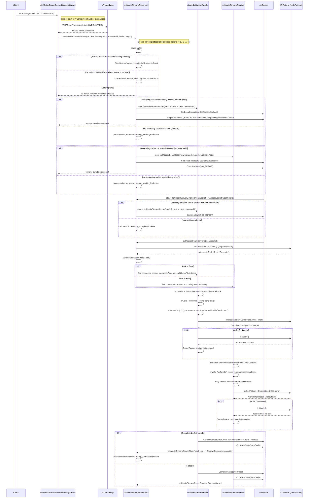
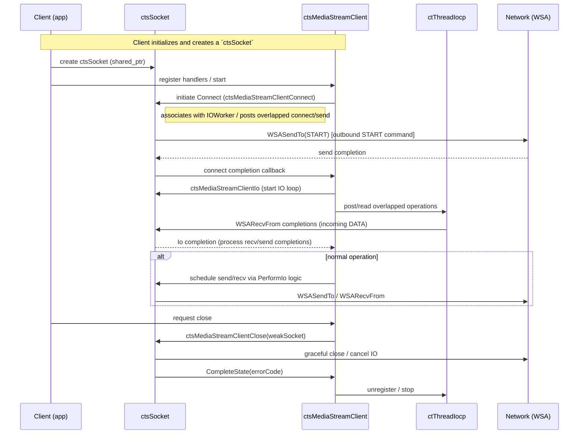

**CTS MediaStream Interactions**

This file documents the interactions between `ctsMediaStreamServerListeningSocket`,
`ctsMediaStreamServerImpl`, `ctsMediaStreamSender`, and the newly supported
`ctsMediaStreamReceiver` code paths. The goal is to clarify the runtime flows for both
sender and receiver roles, and to surface remaining coupling points and refactor ideas.

**Notes / observations**
- **Who owns what:** `ctsMediaStreamServerImpl` manages global containers:
    - `g_listeningSockets`, `g_connectedSockets`, `g_acceptingSockets`, `g_awaitingEndpoints`.
    - `ctsMediaStreamServerListeningSocket` performs low-level recv and forwards raw packets
      to the server via an injected callback (`m_packetCallback`). The server implements
      `OnPacketReceived(...)` which parses packets and now routes to either `StartSender(...)`
      or `StartReceiver(...)` depending on the protocol message.
    - `g_connectedSockets` is an `std::unordered_map` keyed by `ctl::ctSockaddr` for O(1)
      lookups instead of a vector scan.
  - `ctsMediaStreamSender` and `ctsMediaStreamReceiver` each own per-connection timers and scheduling
    and contain the role-specific `PerformIo()` logic (send or receive).

**Direct coupling points (after refactor / remaining):**
- The listening socket is protocol-agnostic and forwards raw datagrams via an injected
  callback (`m_packetCallback`) — parsing and decision logic now live in `Server::OnPacketReceived`.
- The connected sockets (sender and receiver) no longer depend on a server-supplied
  `ConnectedSocketIo` functor — each role implements its own `PerformIo()`.
- `ServerImpl` still holds and mutates the global connection containers (unordered_map for
  `g_connectedSockets`) protected by a single lock, making the server the central coordinator
  and potential contention hotspot. Matching accept/waiting entries must consider role (sender vs receiver)
  and remote address.

**Suggestions to reduce coupling**
- Introduce interfaces/events: the current change injects a callback; consider defining a small
  interface (e.g., `IListenerHandler::OnPacketReceived(...)`) if you prefer compile-time
  decoupling over `std::function`.
- Replace global containers with an injected `ConnectionManager` (interface) to avoid static globals
  and allow unit-testable, pluggable implementations. The manager can provide role-aware lookup APIs
  (e.g., `FindSenderFor(remoteAddr)` / `FindReceiverFor(remoteAddr)`).
- Use a factory or builder to create `ConnectedSocket` instances (inject `IConnectedSocketFactory`),
  so `ServerImpl` doesn't `new` the concrete class directly.
- Limit lock scope and split responsibilities: use per-connection locks or concurrent maps
  for `g_connectedSockets` and `g_awaitingEndpoints` to reduce contention and simplify reasoning.
- If desired, replace `PerformIo` implementations with injected `ISender` / `IReceiver` interfaces later
  to allow pluggable strategies; the current change keeps role logic close to the connection to minimize coupling.
- Consider a message-passing queue for START/ACCEPT events between Listener and Server,
  which decouples timing and allows easier sharding/testing. Make sure events carry the intended role
  so accepting sockets can be matched correctly.

References: the diagrams and notes were produced from reading `ctsMediaStreamServerListeningSocket.cpp`,
`ctsMediaStreamServer.cpp`, `ctsMediaStreamSender.cpp`, and the recently added `ctsMediaStreamReceiver` files
in this repository.

---

**Client Path (ctsMediaStreamClient interactions)**

Below is a Mermaid sequence diagram that focuses on the `ctsMediaStreamClient` side: how
the client code registers and uses `ctsMediaStreamClientConnect`, `ctsMediaStreamClientIo`,
and `ctsMediaStreamClientClose` with a `ctsSocket` and the thread IO system.

Caption: This diagram isolates the client-side lifecycle: create/connect, run IO, and close.
